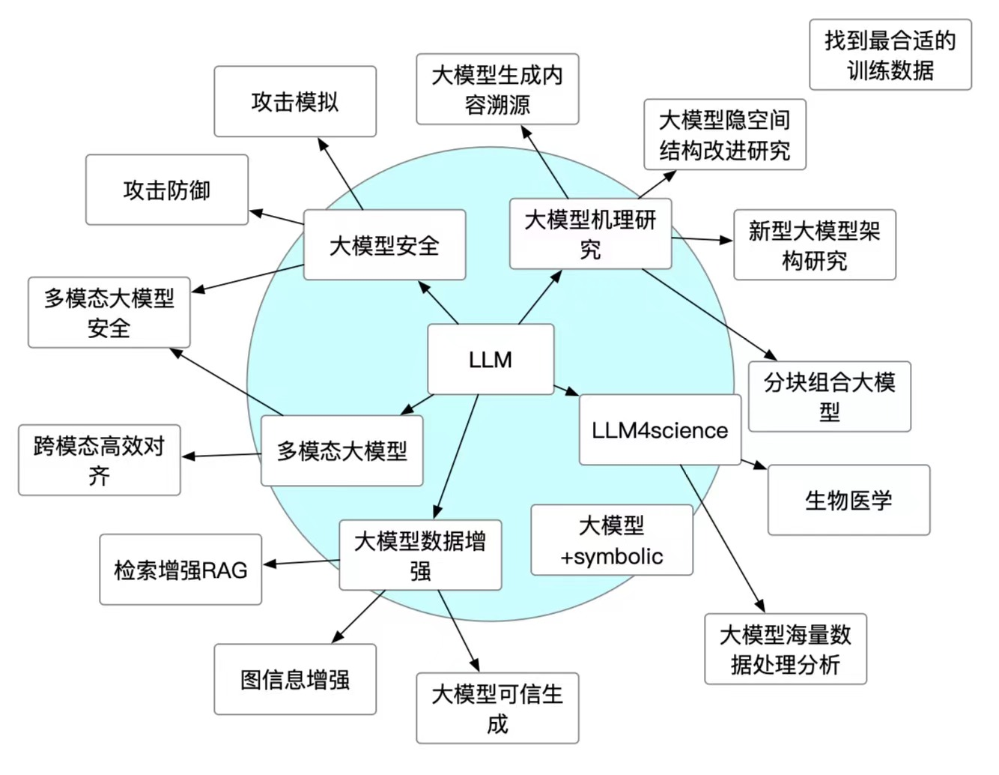

# Group_文献分享

- [Group\_文献分享](#group_文献分享)
  - [目的](#目的)
  - [分享指南](#分享指南)

## 目的

集思广益：收集同学们每周的文献分享内容👀  方便组内其他同学学习相应文献与交流

## 分享指南 

按照组内目前研究方向，大家可以把自己每周分享的内容或平时读到比较好的文献按照六个方向进行上传：

- **大模型安全**
- **大模型机理研究**
- **LLM4science**
- **大模型数据增强**
- **多模态大模型**
- **其他文献**

**分享建议** ：在上传时可以把自己想要上传的内容打包成文件夹（name: 文献/项目 名）push在对应的类别中，同时在相应类别内md文件中简要补全分享文献/项目的基本信息（方便其他同学快速定位查阅）

欢迎同学们贡献文献学习项目！⚒️
